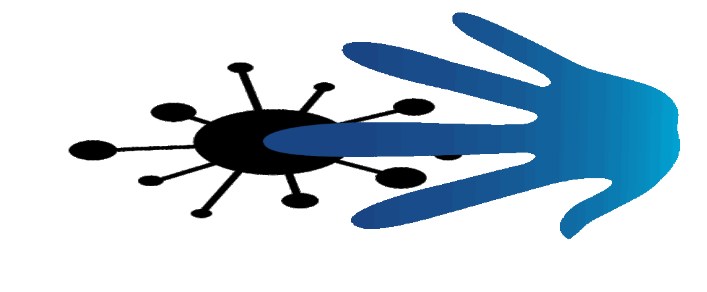
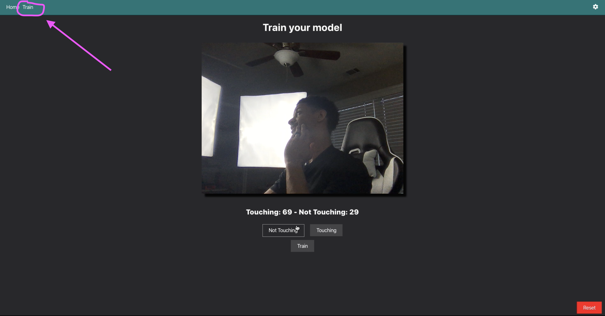

# Smacker Cove - The End of Face Touching

<p align="center">
    <a href="https://smack.ahadcove.com" target="_blank">
      
    </a>
</p>

Smack Cove is the end of face touching as we know it.
Checkout the full video on [Youtube](https://youtu.be/HZTN56UPgkM).

[](http://www.youtube.com/watch?v=HZTN56UPgkM "Creating The Corona Smacker")

Ever wondered why you can't stop touching your face even though you know it could cause harm right now while the corona virus is around?! Well so did we.... So that's why we made Smack Cove!

## [Live-Site](https://smack.ahadcove.com)

<p align="center">
  <a href="https://smack.ahadcove.com" target="_blank">
    
  </a>
</p>


## Build Setup

``` bash
# Clone the repo

# install dependencies
npm install

# Run locally
npm run start

# build for production with minification
npm run build
```

## Running 
Run the app in the development mode with **npm run start**.<br />
Open [http://localhost:1919](http://localhost:1919) to view it in the browser.


## Features

### Training

<p align="center">
  <a href="https://smack.ahadcove.com" target="_blank">
    
  </a>
</p>

You'll have the ability to train your own classifier by opeining up the Train tab in the nav bar.

Once here you can collect images that show you **Touching** and **Not Touching**

After you're done collecting a sufficient amount of images you click Train.

You'll be given the option to **Test** or to **Save**.

After you save your custom model will be ready to use.

### Trigger API

When Smack Cove classifies you as Touching you may want it to react a certain way.

You can determine what happens when you're touching by clicking the cog icon in the top right of the Nav bar.

Here you'll have two API options: **Sound** and **API**

If you click **Sound** the audio file will play every time you touch your face

If you select the **API** option you'll be able to make a get request to wherever you want.

In the Youtube video we made it send a get request to our raspberry pi to trigger our Corona Smacker.

<p align="center">
  <a href="https://smack.ahadcove.com" target="_blank">
    
  </a>
</p>

### Running

Now you're ready to head back to the home page and test things out :)